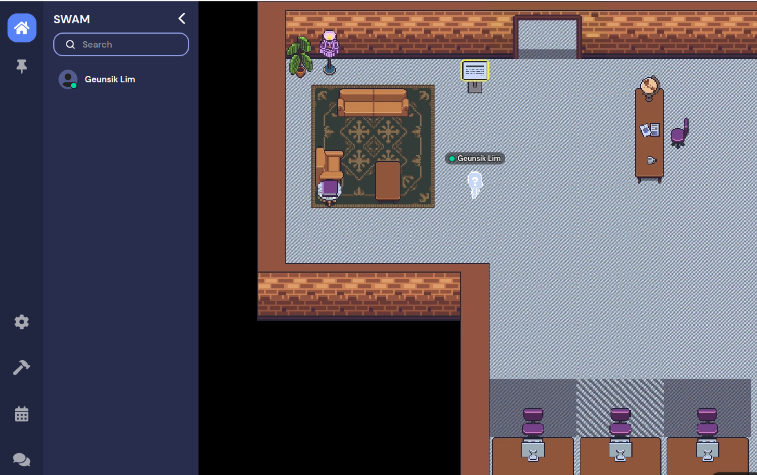

 
   

## https://mobile-swam.github.io
The [official home page](https://mobile-swam.github.io) for mobile-aware SWAM 
* SWAM: Revisiting Swap & OOMK for Improving User Responsiveness on Mobile Devices

 

## Introduction
This paper proposes the SWAM, a new integrated memory management technique that complements the shortcomings of both the swapping and killing mechanism in mobile devices. 
SWAM consists of 
 1. **Adaptive Swap** that dynamically manages the swap space, 
 2. **OOM Cleaner** that preserves the process state by removing the shared object pages instead of killing the processes themselves, 
 3. and **EOOM Killer** that delays high-initialization-cost applications from being victim processes.

 

(Figure: Overall system architecture of SWAM)

Experimental results demonstrate that SWAM significantly reduces the number of applications killed by OOMK (6.5x lower), and improves application launch time (36% faster) and response time (41% faster), compared to the conventional schemes.

## Getting Started
If you want to access the GitHub repository listed below, Please create [new issue](https://github.com/mobile-swam/swam/issues/new) why you want to get the source files (e.g., your name, email, affiliation, technical domain, and purpose). Then, please send an email including the issue number to leemgs.at.gmail.com.
* [SWAM](https://github.com/mobile-swam/swam) (**Member only**)
* [Third-party](https://github.com/mobile-swam/third-party) (**Member only**)

(Figure: Configuring the SWAM kernel with "make menuconfig")

## Demo
This example demonstrates the evaluation result of the Mobile-Aware SWAM. 
Foreground applications are all shown in order.
To view the video file, please click on the "**red**" icon below.
The left video depicts the conventional system, whereas the right video depicts the SWAM system. 
SWAM-based user-space applications can be persistent during a memory contention situation without killing activity, relaunch time, application refreshes, and deferred response time.

(Figure: A demonstration of our proposed SWAM strategy. It takes one minute and twenty-seven seconds.)

## Related Work
We summarize the main contribution, as well as the strong and weak elements, from the meaningful 50 papers among 113 research articles published between 1999 and 2021. 
For more details, please refer to the below links.
* [PDF](/relatedwork/relatedwork.pdf)
* [PNG](/relatedwork/relatedwork.zip)
* [WiKi](https://github.com/mobile-swam/mobile-swam.github.io/wiki/Related-works)

(Figure: The research trend to enhance an application speed on mobile platform)

The above figure illustrates the direction and trend of research articles on securing available memory space between 1999 and 2021. 
By visualizing the statistics as a graph, it is clear that while HDDs are being replaced by faster storage devices (e.g., SSD, eMMC, and eUFS) is developed, research articles on implementing SWAP in mobile devices are progressively increasing, with 2013 as the starting point. 

As can be observed, SWAP is a critical keyword for ensuring consistent and predictable app response time and app launch time in the mobile device environment when memory pressure is achieved. 
While OOM is a strategy for securing free memory without the user's permission, SWAP uses a temporary storage device to secure free memory without killing a process without the user's permission. 
The conventional SWAP facility, on the other hand, has structural issues with thrashing and NAND speed. 
As a result, SWAP studies are critical for resolving these difficulties in mobile devices.

## Discussion Channel
We open a communication channel to discuss on the memory management of mobile devices.
If you want to talk about related studies, techniques, idea, and new challenge, please visit [the SWAM room](https://gather.town/app/AwPmQH37E46wxaN2/SWAM) in gather.town.

(Figure: The SWAM room screenshot at https://gather.town)

## How to Contribute
Contributing to open source can be a wonderful way to learn, teach, and get expertise in almost every skill imaginable.
Please refer to [How to contribute](contributing.md).

## Terminology
The phrase "terminology" refers to a set of specialized terms or definitions related with a particular field, such as the SWAM paper. We address the SWAM project's vocabulary and how it is used to convey specific meanings.

* Conventional Terminologies
  * OOM: Out-of-Memory
  * OOMK: OOM Killer
  * LMK: Low Memory Killer in kernel-land
  * LMKD: LMK Daemon in user-land
  * Segfault: Segmentaiton Fault
  * Anonymous page: A shared page such as stack, heap, shared memory, and shared library (.so)
  * Zram-out: A procedure to move anonymous pages from a system memory to compressed in-memory swap space
  * Swap-out: A procedure to move anonymous pages from a system memory to a storage swap device
  * Swam-out: A procedure to move SO pages from a system memory to a dynamic storage swap device

* SWAM Terminologies
  * ZRAM-region: A compressed swap space in a system memory
  * SWAM-region: A dynamic swap space in a storage device
  * SWAM: **Swa**p + OO**M**K
  * Swap-clean: A procedure to remove swapped-out pages of a SO-page type
  * SO files: Shared Object files (.so) in a storage device (e.g., SSD, eMMC/eUFS)
  * SO pages: Shared Object pages in a memory (e.g., DRAM)
  * Swam files: A file-system based swap file to swap-out/swap-in the SO pages only from/to the memory
