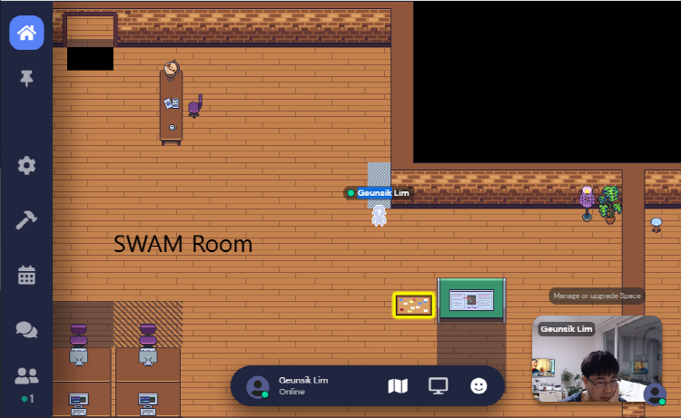

# https://mobile-swam.github.io
The official home page for mobile-aware SWAM (Revisiting Swap & OOMK for New Challenge on Mobile Devices)

  

## Introduction
Recently, to mitigate memory shortage problem of applications in mobile devices, swapping mechanism has been introduced, which can preserve the state of the swapped-out processes. However, frequent swap operations cause very similar effect to thrashing in paging systems, which worsens application responsiveness. Meanwhile, as the size of applications grew, the RAM capacity of mobile devices was increased 16-fold from 512 MB to 8 GB. This change again created an environment where applications consuming larger memory capacity can be developed and more applications can be run. Consequently, modern mobile devices need much larger physical memory capacity as a response to the growing memory competition among the applications. However, even though the physical memory capacity increases, the forced termination of processes due to OOMK operation occurs frequently because more applications use a large memory space indiscriminately, which degrades the application performance significantly.

To solve these problems, this paper proposes the SWAM, a new integrated memory management technique that complements the shortcomings of both the swapping and killing mechanism in mobile devices. SWAM consists of (1) On-Demand Swap that dynamically manages the swap space, (2) OOM Cleaner that preserves the process state by removing the shared object pages instead of killing the processes themselves, and (3) EOOM Killer that delays high-initialization-cost applications from being victim processes. Experimental results demonstrate that SWAM significantly reduces the number of applications killed by OOMK (18x lower), and improves application launch time (41% faster) and response time (48% faster), compared to the conventional schemes.

## Getting Started
* https://github.com/mobile-swam/mobile-swam
* https://github.com/mobile-swam/third-party

## Demo
This demonstration shows the result of the Mobile-Aware SWAM evaluation. Chrome, KakaoTalk, MP3 player, Skype, and the Stock application are all shown in order. The left video depicts the conventional system, whereas the right video depicts the SWAM system. During a memory contention situation, SWAM-based user-space applications can be persistent without killing activity, relaunch time, application refreshes, or deferred response time.

## Related work
We summarize the main contribution, as well as the strong and weak elements, from the meaningful 50 papers among 113 researche articles published between 1999 and 2021.
* For more details, please refer to [HERE](https://github.com/mobile-swam/mobile-swam.github.io/wiki/Related-works).

Between 1999 and 2021, this figure depicts the trend of research articles on protecting available memory space. 
By visualizing the statistics as a graph, it is clear that while HDDs are being replaced by SSDs and fater storage devices (e.g., eMMC/eUFS) is developed, research articles on implementing SWAP in mobile devices are progressively increasing, with 2013 as the starting point. 
As can be observed, SWAP is a critical keyword for ensuring consistent and predictable app response time and app launch time in the mobile device environment when memory pressure is achieved. 
While OOM is a strategy for securing free memory without the user's permission, SWAP uses a temporary storage device to secure free memory without killing a process without the user's permission. 
SWAP, on the other hand, has structural issues with I/O thrashing and NAND speed. 
As a result, SWAP studies are critical for resolving these difficulties in mobile devices.

## Discussion Channel
* https://gather.town/app/AwPmQH37E46wxaN2/SWAM

## How to Contribute
* Please refer to [How to contribute](doc/contributing.md).

## Teminology
* SWAM: Swap + OOMK
* OOM: Out-of-Memory
* OOMK: OOM Killer
* LMK: Low Memory Killer in kernel-space
* LMKD: LMK Daemon in user-space
* Segfault: Segmentaiton Fault
* Anonymous page: A shared page such as stack, heap, shared memory, and shared library
* zram-out: A procedure to move anonymous pages from a memory to compressed in-memory swap space
* swap-out: A procedure to move anonymous pages from a memory to a storage swap device
* swap-clean: A procedure to remove swapped-out pages of a SO-page type
* SO files: Shared Object files (.so) in a storage (e.g., SSD, NnD)
* SO pages: Shared Object pages in a memory (e.g., DRAM)
* swam file: A file-system based swap file to swap-out/swap-in the SO pages only from/to the memory
